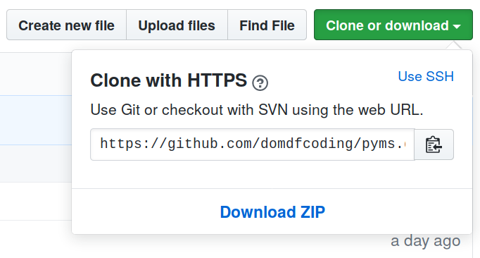

*******************************
Downloading source code
*******************************

|pkgname2| source code resides on publicly accessible GitHub servers,
and can be accessed from the following URL: |ghurl|

If you have ``git`` installed, you can clone the repository with the following command:

.. parsed-literal::

    $ git clone |ghurl|
    > Cloning into '|pkgname|'...
    > remote: Enumerating objects: 47, done.
    > remote: Counting objects: 100% (47/47), done.
    > remote: Compressing objects: 100% (41/41), done.
    > remote: Total 173 (delta 16), reused 17 (delta 6), pack-reused 126
    > Receiving objects: 100% (173/173), 126.56 KiB | 678.00 KiB/s, done.
    > Resolving deltas: 100% (66/66), done.

| Alternatively, the code can be downloaded in a 'zip' file by clicking:
| :guilabel:`Clone or download` -->  :guilabel:`Download Zip`

    Downloading a 'zip' file of the source code